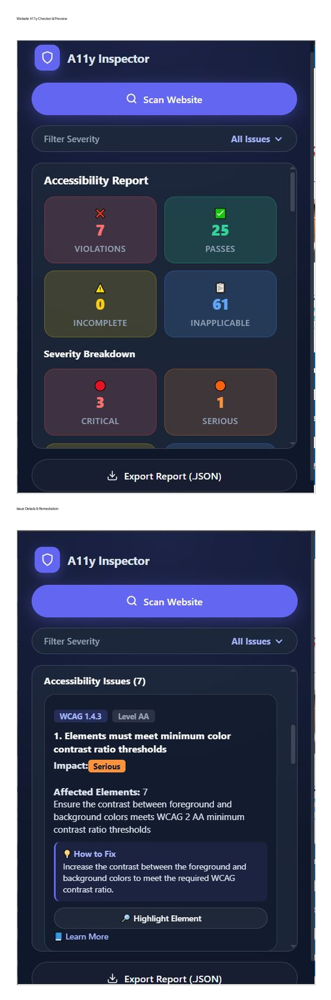

<table>
<tr>
<td width="900">

# 🌐 Website A11y Checker

### Accessibility Testing Chrome Extension

Scan webpages, detect accessibility issues, understand severity, inspect affected elements, and export accessibility reports using **axe-core**.

 

`Chrome Extension` &nbsp; `JavaScript` &nbsp; `axe-core` &nbsp; `Manifest V3`

---

## 🚀 About

**Website A11y Checker** is a Chrome Extension that helps developers identify and investigate accessibility issues directly from the browser.

It uses **axe-core** to analyze webpages and provides a structured report containing accessibility violations, severity, WCAG information, affected elements, remediation guidance, and exportable JSON data.

---

## ✨ Features

<table>
<tr>
<td width="50%">

### 🔍 Accessibility Scanning

Scan the current webpage using axe-core.

### 📊 Summary Dashboard

View Violations, Passes, Incomplete, and Inapplicable results.

### 🎯 Severity Filtering

Filter issues by Critical, Serious, Moderate, and Minor.

### ♿ WCAG Information

View WCAG criteria and conformance levels.

</td>

<td width="50%">

### 🧩 Affected Elements

See the number of elements affected by each issue.

### 🔦 Highlight Element

Locate the affected element directly on the webpage.

### 💡 How to Fix

View basic remediation guidance.

### 📥 JSON Export

Export the complete accessibility scan report.

</td>
</tr>
</table>

---

## 🧠 How It Works

<pre>
Open a webpage
      ↓
Click "Scan Website"
      ↓
Chrome Extension sends scan request
      ↓
axe-core analyzes the webpage
      ↓
Accessibility results are returned
      ↓
Results are displayed in the popup
      ↓
Filter issues by severity
      ↓
View WCAG information
      ↓
Highlight affected elements
      ↓
View remediation guidance
      ↓
Export complete report as JSON
</pre>

---

## 📊 Accessibility Report

<table>
<tr>
<td align="center">

### ❌ Violations

Accessibility rules that failed.

</td>

<td align="center">

### ✅ Passes

Accessibility rules that passed.

</td>

<td align="center">

### ⚠️ Incomplete

Rules requiring further review.

</td>

<td align="center">

### 📋 Inapplicable

Rules not applicable to the page.

</td>
</tr>
</table>

### Severity Levels

<table>
<tr>
<td align="center">🔴 <b>Critical</b></td>
<td align="center">🟠 <b>Serious</b></td>
<td align="center">🟡 <b>Moderate</b></td>
<td align="center">🔵 <b>Minor</b></td>
</tr>
</table>

Issues can be filtered directly from the popup.

---

## ♿ Accessibility Issue Details

Each detected issue can provide:

<table>
<tr>
<td><b>WCAG Criterion</b></td>
<td><b>Conformance Level</b></td>
<td><b>Impact / Severity</b></td>
</tr>

<tr>
<td><b>Affected Elements</b></td>
<td><b>How to Fix</b></td>
<td><b>Learn More</b></td>
</tr>
</table>

The workflow is:

**Detect → Understand → Locate → Fix → Export**

---

## 🔦 Element Highlighting

The extension can highlight affected elements directly on the webpage.

This allows developers to quickly locate the problematic element instead of manually searching through the DOM.

---

## 💡 How to Fix

Detected issues include basic remediation guidance to help developers understand how the accessibility problem can be addressed.

Example:

<pre>
Issue:
Elements must meet minimum color contrast ratio thresholds

How to Fix:
Increase the contrast between the foreground
and background colors to meet the required
WCAG contrast ratio.
</pre>

---

## 📖 Learn More

Each accessibility issue can include a direct link to the relevant **axe-core documentation** for additional technical information.

---

## 📥 JSON Export

The complete accessibility scan can be exported as a structured JSON report.

### Exported Information

<table>
<tr>
<td>🌐 Website URL</td>
<td>🕒 Scan Timestamp</td>
</tr>

<tr>
<td>📊 Accessibility Summary</td>
<td>⚠️ Detected Issues</td>
</tr>

<tr>
<td>🏷️ Issue IDs & Impact</td>
<td>♿ WCAG Information</td>
</tr>

<tr>
<td>🔗 Documentation URLs</td>
<td>🧩 Affected Nodes</td>
</tr>
</table>

### Example

<pre>
{
  "website": "https://example.com",
  "scanTime": "8/8/2026, 10:52:43 AM",
  "summary": {
    "violations": 7,
    "passes": 25,
    "incomplete": 0,
    "inapplicable": 61
  },
  "issues": []
}
</pre>

---

## 🛠️ Tech Stack

<table>
<tr>
<td align="center"><b>JavaScript</b> Extension Logic</td>
<td align="center"><b>HTML5</b> Popup Structure</td>
<td align="center"><b>CSS3</b> User Interface</td>
</tr>

<tr>
<td align="center"><b>Chrome Extension APIs</b> Browser Integration</td>
<td align="center"><b>axe-core</b> Accessibility Analysis</td>
<td align="center"><b>Manifest V3</b> Extension Platform</td>
</tr>
</table>

---

## ⚙️ Installation

<table>
<tr>
<td><b>01</b></td>
<td>Clone the repository</td>
</tr>

<tr>
<td><b>02</b></td>
<td>Open <code>chrome://extensions</code></td>
</tr>

<tr>
<td><b>03</b></td>
<td>Enable <b>Developer Mode</b></td>
</tr>

<tr>
<td><b>04</b></td>
<td>Click <b>Load unpacked</b></td>
</tr>

<tr>
<td><b>05</b></td>
<td>Select the cloned project folder</td>
</tr>

<tr>
<td><b>06</b></td>
<td>Open a webpage and click <b>Scan Website</b></td>
</tr>
</table>

### Clone Repository

<pre>
git clone https://github.com/Adarshkashyap2002/a11y-issue-finder.git
</pre>

---

## 📁 Project Structure

<pre>
a11y-issue-finder/
│
├── manifest.json
├── popup.html
├── popup.js
├── content.js
├── background.js
├── lib/
│   └── axe.min.js
└── README.md
</pre>

---

## 🧪 Testing

The extension has been tested on multiple websites for:

<table>
<tr>
<td>✅ Accessibility Scanning</td>
<td>✅ Issue Detection</td>
<td>✅ Severity Filtering</td>
</tr>

<tr>
<td>✅ Severity Breakdown</td>
<td>✅ WCAG Information</td>
<td>✅ Element Highlighting</td>
</tr>

<tr>
<td>✅ How to Fix Guidance</td>
<td>✅ JSON Export</td>
<td>✅ Documentation Links</td>
</tr>

<tr>
<td>✅ Popup UI</td>
<td>✅ Report Generation</td>
<td>✅ Error Handling</td>
</tr>
</table>

---

## 🔮 Future Improvements

<table>
<tr>
<td>📄 PDF Reports</td>
<td>📚 Scan History</td>
</tr>

<tr>
<td>📈 Accessibility Trends</td>
<td>🔄 Historical Comparison</td>
</tr>

<tr>
<td>📊 Advanced Reporting</td>
<td>🌐 Additional Standards</td>
</tr>
</table>

---

## 📌 Project Status

### 🟢 Version 1.0.1

**Core accessibility scanning and reporting features implemented.**

The current version supports accessibility scanning, severity analysis, WCAG information, remediation guidance, affected-element highlighting, documentation links, and JSON report export.

---

## 📸 Preview

---

## 👨‍💻 Author

### Adarsh Kashyap

Built as a Chrome Extension focused on improving website accessibility testing and reporting.

</td>
</tr>
</table>

---

